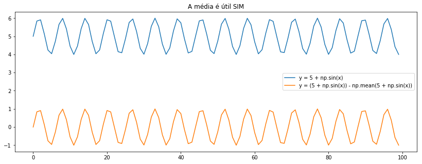

## PyLadies

Coloquei o [site do PyLadies](https://PyLadiesSorocaba.github.io) no ar com o
[Pelican]. Estava entre o Pelican e o Jekyll, que eu uso no blog pessoal, mas
por ser PyLadies e a título de aprendizado mesmo, acabei escolhendo o Pelican.

Ainda falta ajustar umas páginas, adicionar e remover umas coisas, mudar uns
textos e temas etc etc etc, mas o básico tá no ar. :shipit:

---

## Pandas

Finalmente usei direito o `DatetimeIndex`. Aprendi a usar bem também operações como
`.rolling()` pra fazer, por exemplo, média móvel por um determinado período de
tempo.

Consegui usar de maneira bastante eficiente `.loc` e o `.iloc` e o `index.get_loc()`
salvou minha vida de uma maneira que eu nem sei explicar.

Outras funções legais:

- `between_time()`: filtra o dataframe de acordo com um período de tempo
	- Por exemplo `df.between_time('3:00', '4:00')` retorna todos os valores entre 3h e 4h da manhã
-  `indexer_between_time()`: filtra o dataframe como o `between_time()`, mas retorna apenas os índices

---

## DSP

Tirar a média de uma função deslocada, faz com que ela fique "centralizada" em
relação ao eixo x. Ou seja


	x = np.arange(0, 100)
	y = 5 + np.sin(x)	# função original deslocada
	y2 = y - np.mean(y)	# função centralizada

	print(np.min(y), np.max(y))
	# (4.000009793449297, 5.999911860107267)

	print(np.min(y2), np.max(y2))
	# (-1.0037821528251962, 0.9961199138327741)

	# plotando
	plt.plot(x, y, label="y = 5 + np.sin(x)")
	plt.plot(x, y2, label="y2 = (5 + np.sin(x)) - np.mean(5 + np.sin(x))")
	plt.legend()
	plt.title("A média é útil SIM")


Eis que temos

Em termos de processamento de sinais, isso significa que se um sinal vier
com alguma componente DC, que é esse deslocamento vertical do sinal (offset),
você não precisar aplicar algum filtro em tempo real, pode só tirar a média
do sinal e ele vai voltar pro seu devido lugar.

---

## Python 3.8
Sigo ajudando na tradução da documentação do Python 3.8. Por enquanto tô
brincando com a tradução do módulo do `unittest`, o que tá sendo bem
interessante porque tive a minha primeira experiência com testes
automatizados recentemente.

---

## Newsboat
Consegui configurar meu [`newsboat`](https://newsboat.org/) e inserir na minha
lista de urls um blog que descobri recentemente por causa de uma pesquisa a
respeito de testes. Inclusive foi esse blog que me fez querer fazer essa seção
de "dev" pra eu ir notando meu crescimento. Obrigada, [Evee](https://eev.ee/)!

---

## Jekyll
Também arrumei algumas coisas referentes ao site aqui, consertei uns bugs
chatíssimos que estavam me incomodando, como a `nav` zoada da página
inicial e o link errado quando clicava na minha foto, e finalmente inseri
meu currículo no link de [Currículo]({{ site.url }}/{{ site.resume-url }}).
Por enquanto removi a aba de "Projetos" porque ainda preciso terminar ela
com calma. Um passinho de cada vez.

---
## Grep
Descobri que
`grep -nr "<string qualquer>" .` é simplesmente o comando da minha
vida.

- `-n` é usado pra mostrar a linha do arquivo que sua string foi encontrada
- `-r` significa que é recursivo, então procura nas pastinhas dentro das suas
pastinhas. :heart:
- `.` significa pra usar o diretório corrente
