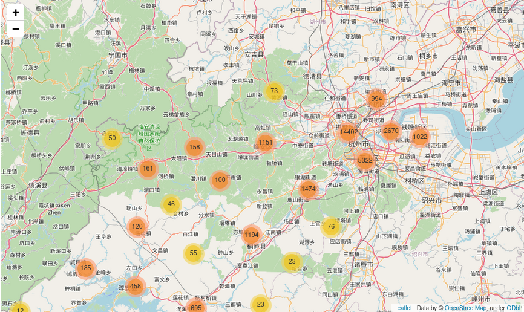
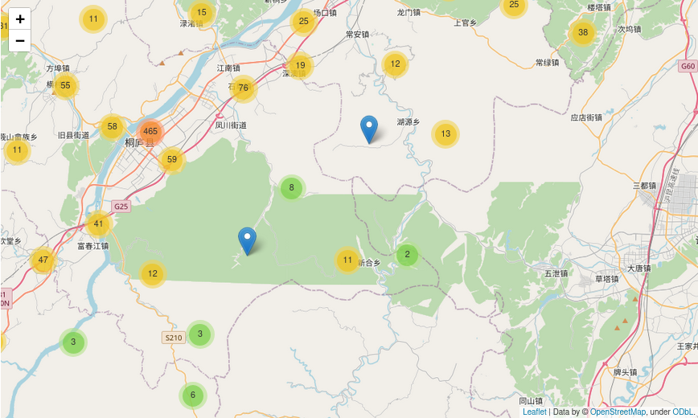

Bom, cá estou re-escrevendo esta MERDA novamente porque eu sou uma anta e
consegui excluir minha postagem inteirinha. Eu não aguento mais a burrice
humana e, especificamente, a minha burrice.

Respirem fundo antes de seguir qualquer coisa escrita no StackOverflow, amigos.

Tinha até feito uma piada com a treta do dev de palco, mas, assim como o texto
anterior, essa piada foi, com o perdão da expressão, pra puta que pariu.
Desculpa aí a grosseria, o combo mestrado + trabalho + perder a postagem me
deixou sem nenhuma paciência pra ficar de gracinha com gente que acha que
trabalho de comunidade é desnecessário.

## PyLadies

O PyLadies vai começar um projeto bem legal nesses tempos de quarentena, cujo
nome é Papo Entre PyLadies. A ideia geral é que os capítulos do PyLadies Brasil
se entrevistem e exponham quais são todas as atividades. Se for possível,
assista as lives! Também é possível direcionar perguntas para os capítulos por
meio desse [form](https://docs.google.com/forms/d/e/1FAIpQLScp5pB7LvP-JmLlOF8H6ICXCocGOR1gV0DPQtjVr5tXkhr_9w/viewform).

Gosto sempre de frisar que o PyLadies é sempre um ambiente mega agradável pra
você aí, que não se sente bem na comunidade dev no geral. A gente tá aqui
justamente pra trazer mais gente pra tecnologia. :wink:


O PyLadies Sorocaba também vai entrevistar e ser entrevistado então se quiser
saber melhor como funciona é só ver a live.
---

## Python

### folium
Tive que voltar a mexer com o folium pra fazer uma análise de dados e, por
causa da quantidade de dados, ficava bastante complicado, e bastante feio
também, de plotar tudo no mapa. Fuçando bastante na documentação, acabei
descobrindo a função do `MarkerCluster`, que ajuda a fazer um mapa com clusters
deixando a visualização bem mais simples. Coloquei aqui duas imagens de exemplo
a partir do mapa gerado. Uma visão mais macro



E uma visão mais micro (que é o zoom no mapa)



Tudo isso em um arquivinho que você tranquilamente pode salvar como html.

### IPython

FINALMENTE criei vergonha na cara pra descobrir como que funciona o
`autoreload` do IPython. Basicamente, a função dele é fazer com que você não
precise ficar fechando o IPython sempre que precisar recarregar algum módulo ou
função.

Deixo aqui o passo-a-passo pra setar o autoreload, mas se você quiser mais
informações, acesse a [página oficial do IPython](https://ipython.readthedocs.io/en/stable/config/extensions/autoreload.html?highlight=autoreload).

```python
In[1]: %load_ext autoreload

In[2]: %autoreload 2
```

e... Pronto! É basicamente isso mesmo. Os parâmetros do autoreload dizem o que
vai ou não ser recarregado. Mais informações no link ali em cima.

---

Pretendo voltar a postar coisas mais frequentementes aqui porque eu acho que é
uma boa forma de validar tudo que eu tenho aprendido e não deixar a síndrome do
impostor fazer com que eu me sinta 1 saquinho de lixo.

Espero logo menos fazer postagens sobre os tópicos de DSP que ando estudando.
Tô pensando em tentar uma abordar mais simples pra que eu não fique doida por
achar que não tá bom suficiente.

Vamos ver no que dá.

Se cuidem e, se for possível, fique em casa!
