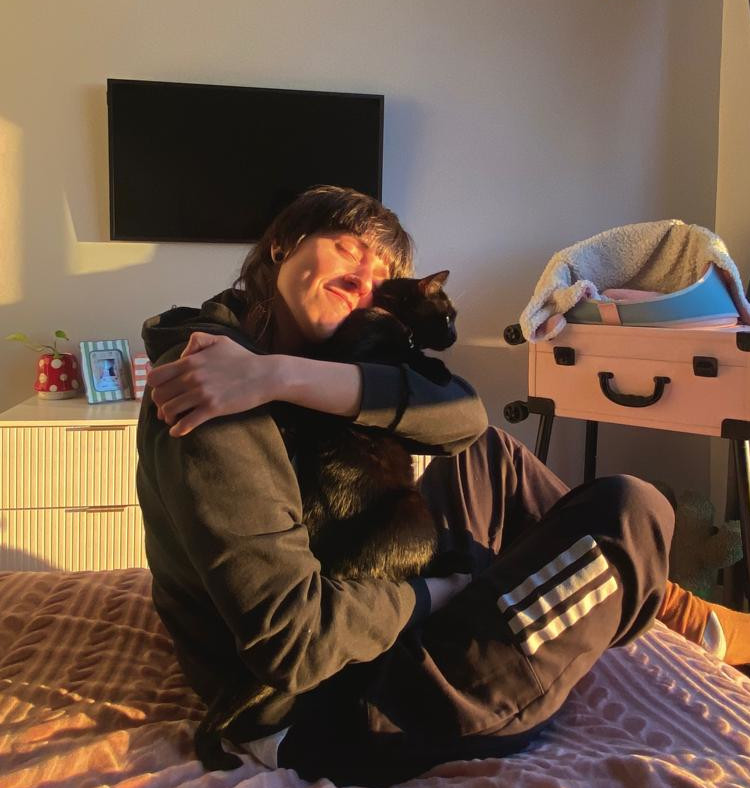

# Sobre

Oi! Meu nome é Giovana e sou cientista da computação pela [Universidade Federal
de São Carlos](www.dcomp.sor.ufscar.br) (UFSCar Sorocaba) e mestra em ciência da
computação pela Universidade de São Paulo (USP), onde fiz parte do grupo do
[COMPMUS](https://compmus.ime.usp.br/) e fui orientada pelo [Prof. Dr. Marcelo
Queiroz](https://www.ime.usp.br/~mqz/).
Atualmente, sou doutoranda na
Universidade de Nova York (NYU) no Music and Audio Research Laboratory, também
conhecido como [MARL](https://steinhardt.nyu.edu/marl), sob a
orientação da [Prof. Dra. Magdalena Fuentes](https://magdalenafuentes.github.io/).

No que diz respeito à pesquisa, meus interesses principais são nas áreas de
recuperação de informação musical (MIR), aprendizado de máquina e processamento
de sinais. Atualmente, estou interessada em interpretar e tentar explicar

Gosto de aplicações que são focadas em repertórios latinoamericanos.
Não é exagero dizer que gosto mais ainda de aplicações e análises focadas em
música brasileira. Ninguém escapa do viés!

Bom, agora que já dei a minha carteirada, posso falar de outras coisas que
gosto. No que diz respeito à projetos no geral, eu gosto de contribuir com
traduções, documentações e, quando possível, código em projetos que uso e que
acredito. Também tenho os meus próprios projetos aleatórios no GitHub.

Pra espairecer, eu ando de bike por aí, passo um tempo com minha família, estico minha
gata toda vez que encontro com ela, leio, desenho, tomo sol, escrevo mal, como
frutinhas, ouço e consumo muito conteúdo de música e de análise musical e, por
fim, jogo videogame! Eu gosto muito de ser ruim em coisas diferentes. talvez
você devesse tentar também, é libertador.

Você me encontra...
* por obrigação no [LinkedIn](https://www.linkedin.com/in/giovana-morais/)
* por vontade própria no [Mastodon](https://bolha.us/@gvmorais)
* falando de livros que estou lendo no [Skoob](https://www.skoob.com.br/usuario/7352542).
* codando projetos aleatórios no [GitHub](https://github.com/giovana-morais)
* zanzando por aí em [Nova York](https://youtu.be/vk6014HuxcE?t=54)
* eventualmente zanzando por [São Paulo](https://youtu.be/vwjVbpKlTUc?t=60)
